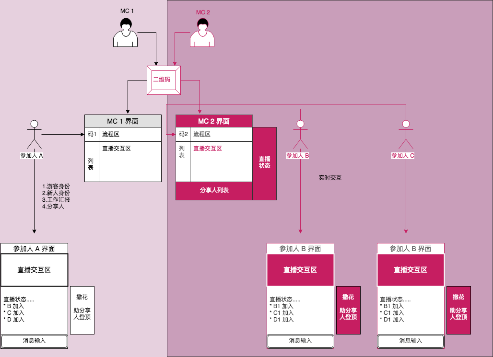
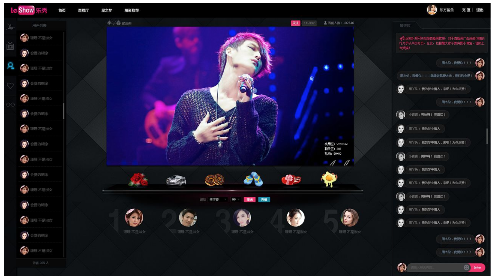
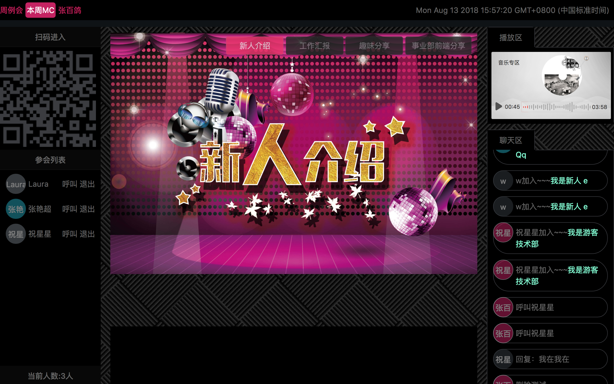

## MC交互神器
`主持` `直播` `互动` `收集例会信息`

### 背景
> 事业部从2017年6月26日开始进行周分享，坚持至今实属不易。虽然例会的内容都非常精彩，但是组织形式还是比较传统的方式，这多少容易让人视觉疲劳。最重要的是，每周主持人都需要自己去问，有没有新人，谁来分享。总之，希望能有一些不一样的体验

### 设计目标
1.提升例会的趣味性
2.减轻MC的工作负担
3.让MC有一种开直播的感觉

### 交互流程图

### 功能点 

MC功能：
* 可以实时看到参加者加入的人和状态‘
* 可以自定义切换音乐（TODO）
* 可以控制会议进度

成员功能：
* 可以实时看到界面状态
* 可以点对点实时沟通
* 可以点对面实时沟通

### 设计流程
#### 设计图

#### 中间的直播区域，做图

### 技术解决方案
#### 端对端
* 服务端 --- 提供统一的消息转发服务
* MC主界面端 --- 提供生成当前MC的二维码，参会人加入后，都会看到当前MC的个人信息 --- 可以对当前MC进行点评
* 参会人界面端 --- 根据MC提供的二维码扫描进入，能够看到当前参会人的状态，以及分享的状态

#### 开发流程
* 确定人员身份、角色、以及不同角色的职责
* 对数据进行log打印分析
* 找UI图进行替换
* 模拟使用流程进行演练
* 对于多端的用户连接
* 原生实现一个本地存储
* 服务端如果断了，需要redis或者本地文件存储之前的信息，然后重连

### 整个流程 

时间 | 内容 | 备注
:----| :----|:----
8月6日 | 开发一个MC神器--让主持变得妙趣横生 | |
8月10日 | 设计交互流程图 实现一个基础的demo ||
8月12日 | 完成设计图 完成样式代码编写 添加MC呼叫个人 添加删除参加者 处理消息的自动滚动 添加所有参加人的消息同步 添加音乐专区 添加自动生成二维码功能 添加会议流程同步 ||
8月13日 | 找身边人进行实用调试 完成MC的一次正式演练 ||
未完待续 | 加入更多互动环节 加入直播视频 加入直播画板 加入视频美颜 加入Live2D ||

### 截屏展示

### 其他
* Draw.io ：流程图
* 马克飞象 ：文档编写
* Websocket ：实现全双工多端通信
* 付费图片网站 ：获取高质量图片资源

