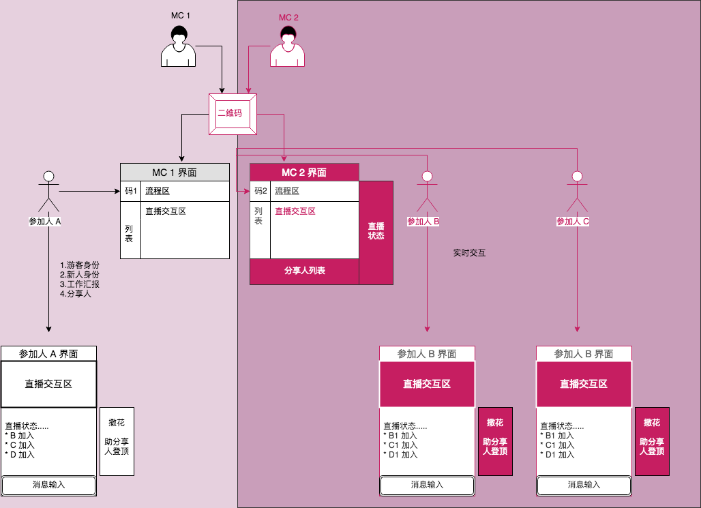

## MC交互神器(一个想法)
`主持` `直播` `互动` `收集例会信息`

### 想法来源
> 事业部从2017年6月26日开始进行周分享，坚持至今实属不易。但是例会的内容都非常精彩，但是组织形式还是比较传统的方式，这多少容易让人视觉疲劳。最重要的是，每周主持人都需要自己去问，有没有新人，谁来分享。总之，希望能有一些不一样的体验

### 目的
> 提升例会的趣味性，减少MC的工作负担。让MC有一种开直播的感觉

我是属于那种，只要有了目标，就可以立马去做的人，所以，这个想法也就是在宣布本人做这周的MC时纠结着要做ppt还是做其他的时候诞生了。所以，上周周五，我梳理了一下整个MC神器的交互流程图

### 交互流程图

### 截屏展示

### 功能点 (Feature)
* 本周MC进入/mc.html 通过扫码进入MC主界面
* 参加者可以通过MC分享的二维码扫码进入
* 参加者可以通过输入不同的角色，进入参加者界面
* MC主界面可以实时看到参加者加入的人和状态
* MC主界面可以自定义切换音乐（TODO）
* MC主界面可以控制会议进度
* 参加者界面可以实时看到界面状态
* 可以点对点实时沟通（TODO）
* 可以点对面实时沟通（TODO）

### 设计开发流程 
 * 小需求整理（整理为什么要做它，它的定位）
 * 根据需求，设计交互流程图
 * 根据交互流程图，设计图
 * 进入代码开发阶段
 * 对功能进行回溯测试
 * 针对下一个阶段进行规划

## 端对端
* 服务端 --- 提供统一的消息转发服务
* MC主界面端 --- 提供生成当前MC的二维码，参会人加入后，都会看到当前MC的个人信息 --- 可以对当前MC进行点评
* 参会人界面端 --- 根据MC提供的二维码扫描进入，能够看到当前参会人的状态，以及分享的状态

## 开发流程
* 确定人员身份、角色、以及不同角色的职责
* 对数据进行log打印分析
* 找UI图进行替换
* 模拟使用流程进行演练

## 遇到的问题
* 对于多端的用户连接
* 原生实现一个本次存储
* 服务端如果断了，需要redis或者本地文件存储之前的信息，然后重连
 
### Example

### API

### 未来扩展

* 加入直播视频
* 加入直播画板
* 加入视频美颜

